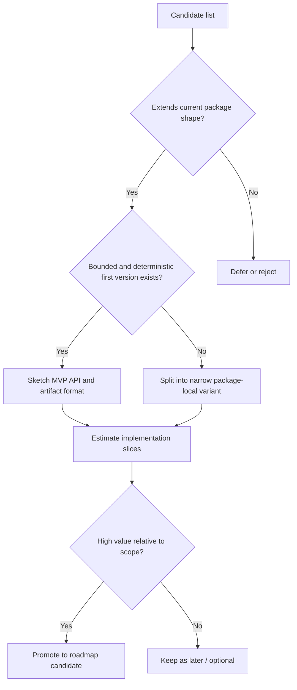
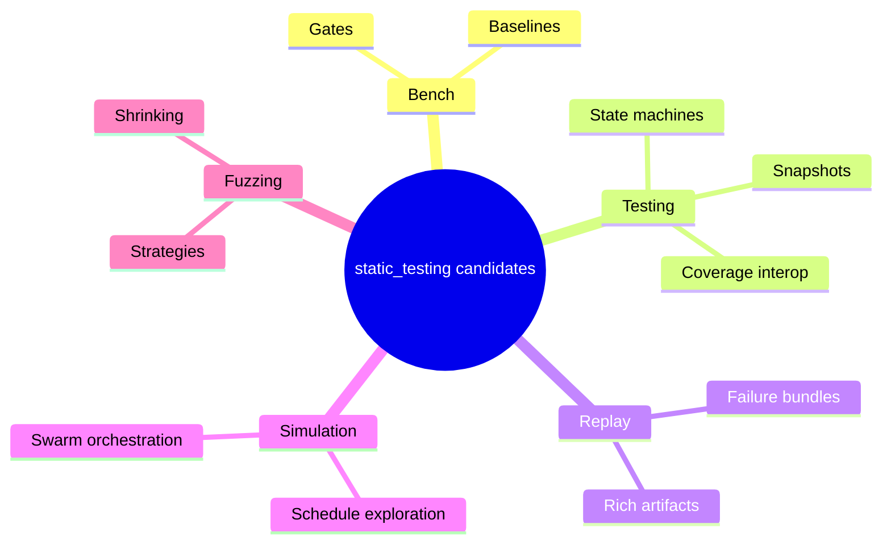

# `static_testing` candidate sketch index - 2026-03-10

Source analysis: `docs/sketches/archive/static_testing_feature_gap_analysis_2026-03-09.md`

## Purpose

This index turns the feature-gap analysis into concrete design-sketch artifacts. Each linked sketch goes beyond "should this exist?" and sketches:

- likely API shape;
- UX and workflow ideas;
- design alternatives;
- implementation slices and non-goals; and
- decision questions that still need answers.

## Candidate matrix

| Candidate | Product value | Scope risk | Difficulty | Suggested phase | Sketch |
| --- | --- | --- | --- | --- | --- |
| Persisted benchmark baselines and gating | High | Medium | Medium | Near-term | `docs/sketches/archive/static_testing_feature_sketch_benchmark_baselines_2026-03-10.md` |
| State-machine / model-based test harness | High | Medium-High | Medium-High | Near-term | `docs/sketches/archive/static_testing_feature_sketch_state_machine_harness_2026-03-10.md` |
| Rich replay failure bundles | High | Medium-High | Medium-High | Near-term | `docs/sketches/archive/static_testing_feature_sketch_replay_failure_bundle_2026-03-10.md` |
| Simulation schedule-exploration modes | Medium-High | Medium-High | Medium | Medium-term | `docs/sketches/archive/static_testing_feature_sketch_schedule_exploration_2026-03-10.md` |
| Swarm runner orchestration | High | Medium-High | Medium | Near-term | `docs/sketches/archive/static_testing_feature_sketch_swarm_runner_orchestration_2026-03-16.md` |
| System/e2e deterministic harness | High | Medium-High | Medium | Near-term | `docs/sketches/archive/static_testing_system_e2e_deterministic_harness_2026-03-18.md` |
| Strategy-based generators and shrink trees | Medium-High | High | High | Only if property testing becomes central | `docs/sketches/static_testing_feature_sketch_strategy_shrinking_2026-03-10.md` |
| Snapshot / golden helpers | Medium | Medium | Low-Medium | Medium-term | `docs/sketches/static_testing_feature_sketch_snapshot_helpers_2026-03-10.md` |
| Coverage-guided fuzzing interop | Medium | High | High | Docs/integration only | `docs/sketches/static_testing_feature_sketch_coverage_interop_2026-03-10.md` |

## Decision chart

## Capability families

## Suggested reading order

1. `docs/sketches/archive/static_testing_feature_sketch_benchmark_baselines_2026-03-10.md`
2. `docs/sketches/archive/static_testing_feature_sketch_state_machine_harness_2026-03-10.md`
3. `docs/sketches/archive/static_testing_feature_sketch_replay_failure_bundle_2026-03-10.md`
4. `docs/sketches/archive/static_testing_feature_sketch_schedule_exploration_2026-03-10.md`
5. `docs/sketches/archive/static_testing_feature_sketch_swarm_runner_orchestration_2026-03-16.md`
6. `docs/sketches/archive/static_testing_system_e2e_deterministic_harness_2026-03-18.md`
7. `docs/sketches/static_testing_feature_sketch_snapshot_helpers_2026-03-10.md`
8. `docs/sketches/static_testing_feature_sketch_strategy_shrinking_2026-03-10.md`
9. `docs/sketches/static_testing_feature_sketch_coverage_interop_2026-03-10.md`

## Cross-cutting strategy sketches

- `docs/sketches/archive/static_testing_artifact_format_strategy_2026-03-18.md`
  captures the newer artifact-storage decision that cuts across benchmark,
  replay, simulation, and long-run campaign outputs.
- `docs/sketches/archive/static_testing_repair_liveness_execution_2026-03-21.md`
  captures the follow-on repair/liveness execution contract surfaced by the
  TigerBeetle VOPR comparison.
- `docs/sketches/archive/static_testing_simulator_fault_richness_2026-03-21.md`
  captures the follow-on network/storage/time simulator expansion work surfaced
  by the same comparison.
- `docs/sketches/archive/static_testing_ordered_effect_sequencer_2026-03-21.md`
  captures the reusable ordered-effect helper that was later implemented
  directly without its own long-lived active feature plan.

## Shared constraints

Every sketch assumes the same package constraints unless the sketch explicitly argues for changing them:

- deterministic replay matters more than raw feature breadth;
- bounded storage and explicit artifacts are preferred over hidden allocation;
- public error sets should remain explicit;
- the first version of any feature should be narrow enough to explain in one page of docs; and
- features that require external runtimes, toolchains, or intrusive instrumentation should stay opt-in.
