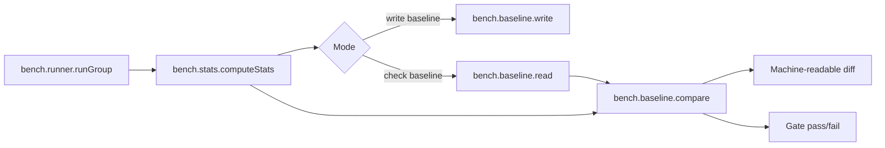
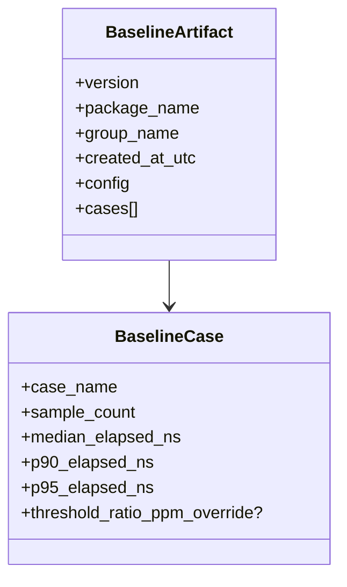

# Sketch: Persisted benchmark baselines and gating

Related analysis: `docs/sketches/archive/static_testing_feature_gap_analysis_2026-03-09.md`

## Goal

Let users persist a benchmark baseline, reload it later, compare the new run against the saved baseline, and optionally gate CI or local validation on explicit regression thresholds.

## Why this fits

- It extends the existing `bench.stats`, `bench.compare`, and `bench.export` surfaces directly.
- It solves a common next-step problem for the current benchmark suite: "what changed since the last good run?"
- It stays artifact-oriented and deterministic if the baseline format is explicit and stable.

## Product sketch

### User stories

1. Save a known-good baseline after a local measurement run.
2. Compare the current run to that baseline in CI and fail when a configured threshold is exceeded.
3. Export both the raw results and the diff so a reviewer can inspect what changed.

### UX idea

```text
baseline write:
  run benchmark -> derive stats -> persist baseline artifact

baseline check:
  run benchmark -> derive stats -> load baseline -> compare -> gate -> export diff
```

### API direction

```zig
const baseline = bench.baseline;

pub const BaselineConfig = struct {
    case_threshold_ratio_ppm_default: u32 = 50_000,
    allow_new_cases: bool = false,
};

pub const BaselineArtifact = struct {
    package_name: []const u8,
    benchmark_group_name: []const u8,
    results: []const bench.stats.BenchmarkStats,
};

pub fn writeBaseline(
    writer: *std.Io.Writer,
    artifact: BaselineArtifact,
) !void

pub fn readBaseline(
    bytes: []const u8,
) !BaselineArtifactView

pub fn compareAgainstBaseline(
    baseline_view: BaselineArtifactView,
    current_results: []const bench.stats.BenchmarkStats,
    config: BaselineConfig,
) !BaselineComparison
```

## Workflow diagram



## Design options

| Option | Shape | Pros | Cons | Recommendation |
| --- | --- | --- | --- | --- |
| A | JSON baseline artifact | Easy to inspect, easy to diff, easy to debug | Larger files, versioning must stay careful | Best MVP |
| B | Binary baseline artifact | Compact, explicit typing, faster decode | Harder to inspect by eye, more tooling needed | Good later if artifacts grow |
| C | Reuse existing export JSON directly | Smallest surface increase | Export JSON is presentation-oriented, not baseline-oriented | Avoid for MVP |

## Suggested artifact shape



## UX options for gating

| UX | Example | Fit |
| --- | --- | --- |
| Library-first | caller loads baseline bytes and calls compare API | Best fit for current package |
| Build-step helper | `zig build bench-check` | Useful later, but not the MVP |
| CLI tool | standalone `static-testing-bench` | Probably outside current scope |

## Difficulty chart

| Slice | Difficulty | Notes |
| --- | --- | --- |
| Stable baseline artifact schema | Medium | Must be versioned from day one |
| Baseline read/write helpers | Medium | Mostly straightforward serialization |
| Matching current vs baseline cases | Medium | Need explicit policy for missing/new cases |
| Gating semantics | Medium | Keep thresholds simple and explicit |
| Reporting UX | Medium | Should stay machine-readable first |

## MVP

1. JSON artifact with explicit schema version.
2. Save only derived stats, not raw samples.
3. Exact case-name matching.
4. One default threshold, optional per-case override.
5. Machine-readable comparison result plus plain-text summary helper.

## Non-goals

- HTML reports.
- Chart generation.
- Bootstrap statistics.
- Automatic noise modeling.
- Hidden global baseline directories.

## Open questions

1. Should a new case be a failure by default or only a warning?
2. Should the artifact include full run config for auditability?
3. Should the baseline compare on median only, or median plus tail percentiles?

## Recommendation

This is a strong candidate for a near-term feature because it extends existing code directly and can stay bounded if it avoids Criterion-style scope expansion.
