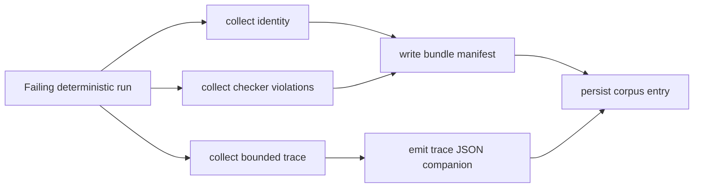
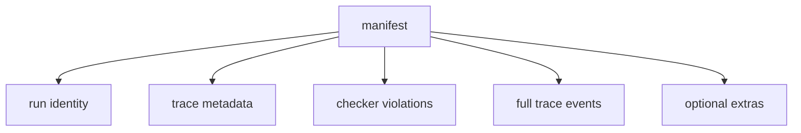

# Sketch: Rich replay failure bundles

Related analysis: `docs/sketches/archive/static_testing_feature_gap_analysis_2026-03-09.md`

## Goal

Evolve replay artifacts from identity-plus-trace-metadata into richer failure bundles that capture enough context to debug deterministic failures without rerunning immediately.

## Why this fits

- `TraceBuffer` already stores bounded events and exports Chrome trace JSON.
- `replay_artifact.zig` already has versioned binary encoding/decoding.
- `corpus.zig` already persists deterministic artifacts.
- `checker.zig` already provides structured violations that can be included in a bundle.

## Proposed bundle content

| Component | Why include it | First version? |
| --- | --- | --- |
| Manifest / header | Stable entry point and versioning | Yes |
| Run identity | Needed for replay and naming | Yes |
| Trace metadata | Already present today | Yes |
| Full trace events | Key debugging value | Yes |
| Checker violations | Makes failures self-describing | Yes |
| Optional checkpoint digests | Useful for fast narrowing | Maybe |
| Optional stdout / stderr | Helpful for process-driver cases | Maybe |

## Bundle layout options

### Option A: Directory bundle

```text
failure_bundle/
  manifest.json
  artifact.bin
  trace.json
  violations.json
  checkpoints.json
```

Pros:

- easy to inspect;
- easy to diff;
- can reuse existing trace JSON directly.

Cons:

- multi-file lifecycle;
- harder atomic writes;
- more filesystem bookkeeping.

### Option B: Single binary container

Pros:

- atomic write;
- easier to move around;
- compact.

Cons:

- less inspectable;
- harder to debug by hand;
- format tooling burden increases.

### Option C: Hybrid

- store one binary bundle plus optional emitted trace JSON next to it.

Recommendation:

- Best compromise after MVP, but start with Option A if human inspection is the priority.

## Workflow diagram



## UX ideas

```zig
const bundle = testing.testing.failure_bundle;

pub const BundleWriteOptions = struct {
    emit_trace_json: bool = true,
    include_checkpoints: bool = false,
};

pub fn writeFailureBundle(
    io: std.Io,
    dir: std.Io.Dir,
    options: BundleWriteOptions,
    input: FailureBundleInput,
) !FailureBundleMeta
```

Possible higher-level user flow:

1. failing run produces `CheckResult.fail`;
2. harness writes bundle automatically if configured;
3. user opens `trace.json` in Chrome trace viewer or a future viewer;
4. user reloads binary bundle into a replay tool or debug command.

## Design tradeoffs chart

| Axis | Directory bundle | Binary bundle | Hybrid |
| --- | --- | --- | --- |
| Human inspectability | High | Low | Medium-High |
| Atomicity | Low | High | Medium |
| Tooling complexity | Medium | High | High |
| Compatibility with current code | High | Medium | Medium |

## Mermaid artifact graph



## MVP

1. Directory bundle.
2. Manifest + binary artifact + trace JSON + violations JSON.
3. Stable naming through existing corpus conventions.
4. Decode/read API for tooling later.

## Non-goals

- Building a full web UI.
- Capturing unlimited logs.
- Capturing arbitrary user payloads by default.
- Making replay bundles the only persistence format immediately.

## Open questions

1. Should full trace events live in JSON only, or also in the binary bundle?
2. Are checker violations enough, or is checkpoint digest capture necessary in the first release?
3. Does the package want a "single file" story for CI artifact upload from day one?

## Recommendation

This is a strong debugging-quality feature if kept artifact-first. The narrow version should focus on persisted context, not on building a viewer.
