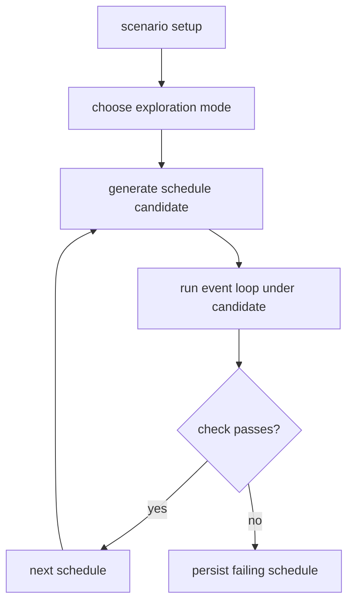

# Sketch: Simulation schedule-exploration modes

Related analysis: `docs/sketches/archive/static_testing_feature_gap_analysis_2026-03-09.md`

## Goal

Add bounded schedule-exploration modes for the existing simulation layer so users can run more than one deterministic scheduling policy against the same simulation setup.

## Why this fits

- `sim.scheduler` already records and replays explicit decisions.
- `sim.event_loop` already executes bounded, deterministic steps.
- The package already has the right abstractions for a package-local exploration runner without pretending to be a full concurrency model checker.

## Scope boundary

This sketch is **not** a Loom or Shuttle clone.

It is a narrower idea:

- run the existing simulation workload under a bounded set of schedule policies;
- persist the schedule that triggers a failure; and
- expose enough API to replay and compare those schedules later.

## Candidate modes

| Mode | Meaning | Why useful |
| --- | --- | --- |
| `.first` | Current deterministic greedy policy | Stable baseline |
| `.seeded` | Current deterministic seeded choice | Broad simple exploration |
| `.portfolio` | Try several seeds / policies per case | Best near-term value |
| `.pct` | Probabilistic concurrency testing style preemption bias | Good bug-finding leverage |
| `.dfs` | Bounded depth-first schedule exploration | Useful for small models only |

## UX idea

```zig
const explore = testing.testing.sim.explore;

pub const ExplorationMode = enum {
    first,
    seeded,
    portfolio,
    pct,
    dfs,
};

pub const ExplorationConfig = struct {
    mode: ExplorationMode,
    schedules_max: u32,
    steps_per_schedule_max: u32,
    seed: testing.testing.seed.Seed,
};

pub fn runExploration(
    config: ExplorationConfig,
    runner: *const SimulationScenario,
) !ExplorationResult
```

## Workflow diagram



## Design options

| Option | Shape | Pros | Cons | Recommendation |
| --- | --- | --- | --- | --- |
| A | Portfolio over existing `.first` and `.seeded` plus many seeds | Smallest change, uses today’s code | No new search algorithm | Best MVP |
| B | Add package-local PCT mode | Better bug-finding for race-like scenarios | More schedule bookkeeping | Good phase-2 |
| C | Add bounded DFS over `ScheduleDecision` trees | Strong exhaustive semantics for tiny cases | State explosion quickly | Only for very small models |
| D | General runtime/thread schedule exploration | Most powerful | Entirely different product scope | Reject |

## Mode chart

| Mode | Value | Complexity | Risk |
| --- | --- | --- | --- |
| Portfolio | High | Low-Medium | Low |
| PCT | Medium-High | Medium | Medium |
| DFS | Medium | Medium-High | High |
| General concurrency model checking | High | Very High | Very High |

## Replay diagram

```mermaid
sequenceDiagram
    participant Explore as Exploration runner
    participant Sched as sim.scheduler
    participant Loop as sim.event_loop
    participant Artifact as replay/failure store

    Explore->>Sched: select mode / seed / schedule
    Sched->>Loop: drive next decision
    Loop->>Artifact: persist failing decision stream
```

## MVP

1. Portfolio mode only.
2. Configurable number of seeds or schedule attempts.
3. Persist the failing `ScheduleDecision` list.
4. Plain-text summary of which schedule failed.

## Non-goals

- Replacing synchronization primitives.
- Exploring arbitrary real threads.
- Claiming exhaustive correctness outside the simulation layer.

## Open questions

1. Should exploration live under `testing.sim.explore` or as an option on `event_loop` itself?
2. Is the artifact a raw decision list, or a richer exploration record with seed/mode metadata?
3. Should portfolio mode vary only scheduler choices, or also fault-script permutations?

## Recommendation

Pursue only the package-local variant. Start with a portfolio runner over today's simulation primitives. Do not market it as general concurrency testing.
