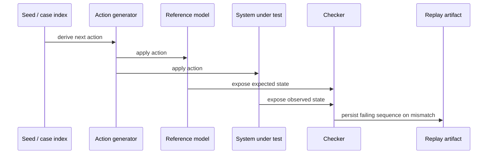
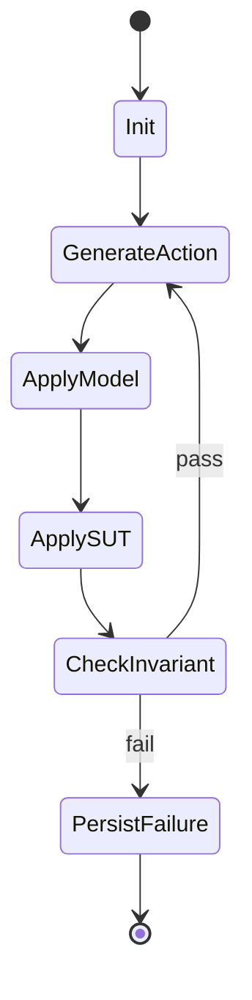

# Sketch: State-machine / model-based test harness

Related analysis: `docs/sketches/archive/static_testing_feature_gap_analysis_2026-03-09.md`

## Goal

Let users express a reference model plus deterministic actions, then run those actions against both the model and the system under test while preserving replay, reduction, and failure artifacts.

## Why this fits

- It matches the package's existing deterministic seeds, replay identities, and checker vocabulary.
- It naturally complements `testing/replay_runner.zig`, `testing/checker.zig`, and `testing/sim/`.
- It gives the package a way to express richer behavior tests without importing an entire property-testing ecosystem.

## Desired UX

```zig
const model = testing.testing.model;

const Harness = model.StateMachineHarness(
    ModelState,
    SystemState,
    Action,
    CheckError,
);

var harness = Harness.init(.{
    .seed = .init(1234),
    .action_count_max = 64,
    .model = .{
        .init_fn = ModelState.init,
        .apply_fn = ModelState.apply,
    },
    .sut = .{
        .init_fn = SystemState.init,
        .apply_fn = SystemState.apply,
    },
    .actions = .{
        .next_fn = Action.next,
    },
    .checker = .{
        .check_fn = ModelState.checkAgainst,
    },
});

const result = try harness.run();
```

## Core workflow



## Design options

| Option | Shape | Pros | Cons | Recommendation |
| --- | --- | --- | --- | --- |
| A | Sequential state-machine harness only | Smallest feature, easiest to reason about | No concurrent scheduling story | Best MVP |
| B | Sequential harness + reducer-aware action shrinking | Stronger debugging story | More complex failure minimization | Best phase-2 |
| C | Full strategy-driven state-machine DSL | Powerful and expressive | Large surface area, starts to overlap with Proptest | Avoid as MVP |

## Suggested package structure

```text
src/testing/
  model/
    root.zig
    harness.zig
    action_trace.zig
    failure_artifact.zig
```

## UX options

| UX | Description | Tradeoff |
| --- | --- | --- |
| Callback bundle | User provides init/apply/check callbacks | Lowest abstraction, best fit today |
| Transition enum + generated harness | Stronger type guidance | Slightly more boilerplate |
| Builder DSL | Most ergonomic | Probably too much for first version |

## State diagram



## Difficulty chart

| Slice | Difficulty | Notes |
| --- | --- | --- |
| Typed harness core | Medium | Mostly callback plumbing and artifact shapes |
| Action trace persistence | Medium | Natural fit with replay concepts |
| Reduction/shrinking integration | Medium-High | Strong value, but second phase |
| Concurrent/stateful schedule coupling | High | Do not mix into the MVP |

## MVP

1. Sequential deterministic action runner.
2. Fixed action budget.
3. Action trace artifact on failure.
4. Explicit checker callback.
5. Optional reducer hook for failure minimization later.

## Non-goals

- Rebuilding a full property-testing framework.
- Implicit random generators.
- Async runtime integration.
- General concurrent model checking.

## Decision questions

1. Is the first use case sequential API state machines, or simulation-driven protocols?
2. Should failure artifacts store actions only, or both actions and state digests?
3. Should action generation stay callback-only, or reserve names for future typed generators?

## Recommendation

This is one of the best-fit candidates. It extends the package's current replay/checker philosophy without forcing it to become a general-purpose property-testing clone.
