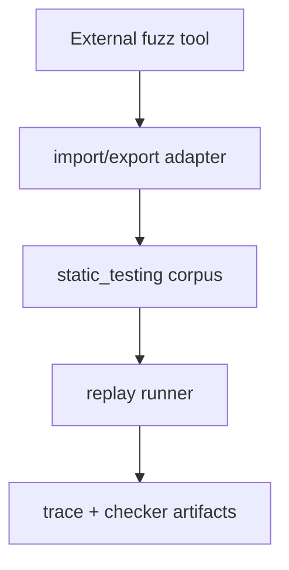

# Sketch: Coverage-guided fuzzing interop

Related analysis: `docs/sketches/archive/static_testing_feature_gap_analysis_2026-03-09.md`

## Goal

Improve interoperability between `static_testing`'s deterministic fuzz/corpus model and external coverage-guided fuzzing tools, without turning `static_testing` into a coverage-guided fuzzer itself.

## Why this could help

- Teams often want both deterministic replay artifacts and external engine bug-finding power.
- `static_testing` already has corpus naming, persisted artifacts, and deterministic replay concepts.
- A thin interoperability layer could make failures found elsewhere easier to replay and triage inside this package.

## Scope boundary

This sketch intentionally avoids building:

- a coverage-guided engine;
- compiler instrumentation management;
- sanitizer orchestration; or
- a replacement for `cargo fuzz`, libFuzzer, or AFL-style tools.

## Possible UX

```zig
const interop = testing.testing.fuzz_interop;

try interop.importCorpusDir(io, src_dir, dst_dir, .{
    .format = .raw_bytes,
    .naming = .{ .prefix = "imported" },
});

const replay_input = try interop.decodeExternalFinding(bytes, .{
    .source = .cargo_fuzz,
});
```

## Workflow


## Design options

| Option | Shape | Pros | Cons | Recommendation |
| --- | --- | --- | --- | --- |
| A | Docs-only cookbook | Lowest maintenance | No reusable API | Good first move |
| B | Import/export helpers only | Useful and bounded | Still requires format decisions | Best actual feature boundary |
| C | Active adapter runner that shells out to fuzzers | More automation | Toolchain/platform complexity spikes | Avoid in core |

## UX chart

| Interop slice | Value | Complexity |
| --- | --- | --- |
| Import raw external corpus bytes | Medium | Medium |
| Export `static_testing` corpus to external directories | Medium | Medium |
| Generate coverage reports from inside package APIs | Medium-High | High |
| Full end-to-end fuzz-driver orchestration | High | Very High |

## Mermaid component view



## MVP if pursued

1. Import/export helper APIs only.
2. Explicit format enum per external source.
3. No subprocess orchestration.
4. No promises about coverage semantics inside `static_testing`.

## Non-goals

- Running instrumented fuzz targets from this package.
- Owning nightly or sanitizer setup.
- Treating external coverage as deterministic package state.

## Decision questions

1. Is docs-only guidance enough, or is there repeated enough friction to justify helper APIs?
2. Which external corpus formats matter first?
3. Should imported findings map to raw bytes only, or to richer structured artifacts when possible?

## Recommendation

This should remain integration-oriented. If implemented, keep it as a thin adapter layer and leave the actual coverage-guided loop to external tools.
