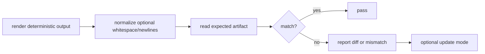
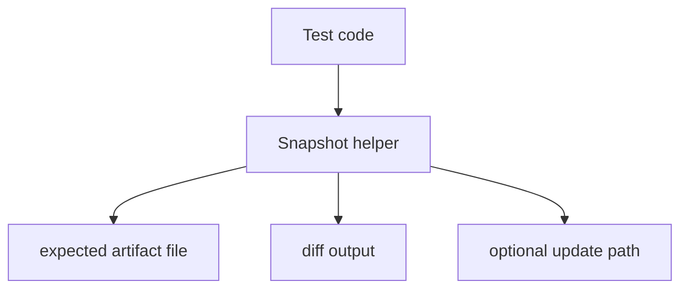

# Sketch: Snapshot / golden helpers

Related analysis: `docs/sketches/archive/static_testing_feature_gap_analysis_2026-03-09.md`

## Goal

Provide a small helper layer for stable output approval tests over existing `static_testing` artifacts such as export formats, replay bundles, trace JSON, and other deterministic text or binary outputs.

## Why this fits

- The package already emits deterministic artifacts.
- Several existing tests already compare full output strings directly.
- A small helper could remove repetitive temp-dir and file-read boilerplate without taking over test design.

## UX ideas

```zig
const snapshot = testing.testing.snapshot;

try snapshot.expectBytes(io, dir, .{
    .path = "expected/trace.json",
    .mode = .assert_only,
    .actual = rendered_trace_json,
});

try snapshot.expectJson(io, dir, .{
    .path = "expected/export.json",
    .actual = rendered_json,
    .normalize_newlines = true,
});
```

## Workflow diagram



## Design options

| Option | Shape | Pros | Cons | Recommendation |
| --- | --- | --- | --- | --- |
| A | Explicit file-path API | Clear and low magic | Slightly more call-site verbosity | Best MVP |
| B | Convention-based file layout | Lower boilerplate | Hidden naming rules | Maybe later |
| C | Inline snapshot literals | Easy for tiny strings | Poor fit for large artifacts and Zig source files | Avoid |

## UX modes

| Mode | Meaning | Fit |
| --- | --- | --- |
| `.assert_only` | Fail if artifact differs | Best default |
| `.write_if_missing` | Bootstrap a new artifact | Useful and safe |
| `.update` | Overwrite expected output | Helpful locally, dangerous in CI |

## Chart: signal vs noise

| Choice | Signal quality | Noise risk |
| --- | --- | --- |
| Stable exported JSON/CSV/Markdown | High | Low |
| Large verbose traces | Medium | Medium |
| Frequently changing logs | Low | High |

## Mermaid artifact layout



## MVP

1. Bytes/text compare only.
2. Explicit file-path API.
3. Assert-only and write-if-missing modes.
4. No fancy diff engine at first.

## Non-goals

- Snapshot auto-discovery by magic names.
- Inline source snapshots.
- Rich interactive diffs.
- Hidden global update flags.

## Decision questions

1. Does the package want to own update workflows, or only comparison helpers?
2. Should binary artifact comparison be supported from day one?
3. Is newline normalization enough, or do users need JSON pretty-print normalization too?

## Recommendation

This is a good low-to-medium effort feature if kept very small. The package should avoid turning it into a full approval-testing framework.
