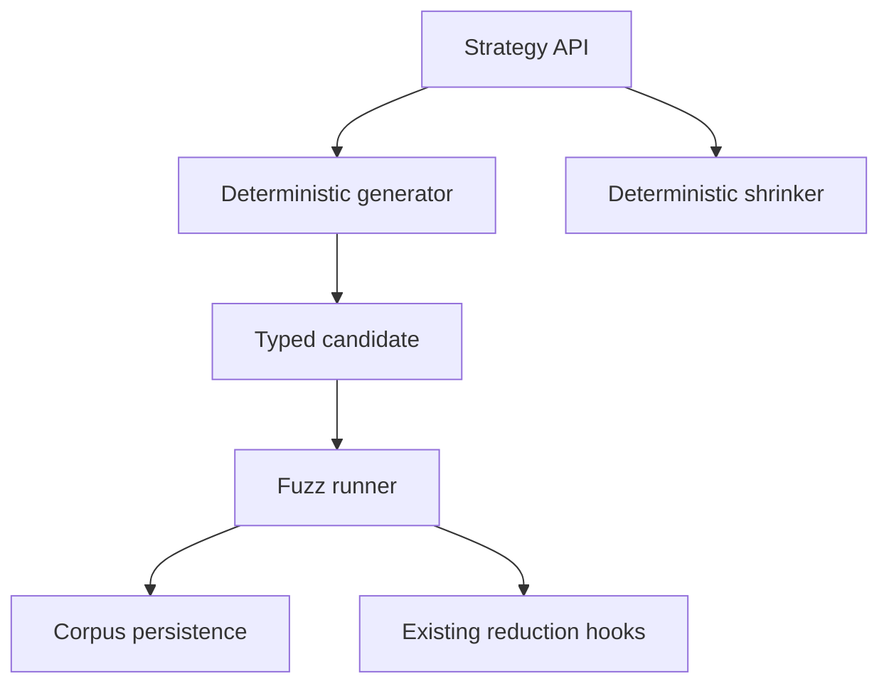

# Sketch: Strategy-based generators and shrink trees

Related analysis: `docs/sketches/archive/static_testing_feature_gap_analysis_2026-03-09.md`

## Goal

Offer typed input-generation strategies and structured shrinking on top of the deterministic fuzz runner, without immediately turning the package into a full Proptest analogue.

## Why this might be valuable

- Some APIs are much easier to test from typed generated values than from raw split-seed derivation.
- It would let `static_testing` express "generate a small valid config" or "generate a bounded message sequence" directly.
- The package already has deterministic seeds, a reducer concept, and corpus persistence.

## Key risk

This is the highest scope-creep candidate in the set. A good strategy system is a large product, not just a helper.

## Possible UX

```zig
const strat = testing.testing.strategy;

const user_strategy =
    strat.structOf(User, .{
        .id = strat.u32.range(1, 10_000),
        .name = strat.bytes.ascii(.{ .len_max = 24 }),
        .enabled = strat.bool.any(),
    });

const run_result = try testing.testing.fuzz_runner.runStrategy(.{
    .strategy = user_strategy,
    .case_count_max = 128,
    .seed = .init(1234),
});
```

## Workflow


## Design options

| Option | Shape | Pros | Cons | Recommendation |
| --- | --- | --- | --- | --- |
| A | Tiny fixed-capacity generator library only | Bounded and explicit | Limited expressiveness | Best if pursued at all |
| B | Generator + shrinker for a few primitives and arrays | More useful immediately | Still substantial design surface | Plausible phase-1 |
| C | Full compositional Proptest-like algebra | Most powerful | Too large for current package | Reject as MVP |
| D | Keep reducer only, no strategies | Lowest complexity | Misses typed generation entirely | Current state |

## UX tradeoffs

| UX | Benefit | Cost |
| --- | --- | --- |
| Explicit generator structs | Most controllable and debuggable | More verbose |
| Fluent builder API | Nice ergonomics | More surface and naming complexity |
| Macro/derive-heavy API | Lowest user boilerplate | Poor fit for current package ethos |

## Difficulty chart

| Slice | Difficulty | Notes |
| --- | --- | --- |
| Primitive generators | Medium | Straightforward but still needs stable semantics |
| Array/struct composition | High | Must manage boundedness and shrink order |
| Shrink trees | High | Easy to get wrong semantically |
| Corpus integration | Medium | Natural fit once candidate serialization exists |

## Mermaid component sketch



## MVP if pursued

1. Primitive generators only.
2. Fixed-capacity arrays/slices.
3. No recursion.
4. Very small shrink vocabulary.
5. Explicit serialization hook for corpus persistence.

## Non-goals

- Recreating Proptest-level strategy algebra.
- Hidden dynamic allocation.
- Recursive or unbounded strategies in the first version.
- Dozens of combinators before real users exist.

## Decision questions

1. Is typed generation actually a primary use case for this package, or only a nice-to-have?
2. Can the package define a small enough first vocabulary to stay aligned with boundedness rules?
3. Should shrinking reuse the existing reducer semantics or stay separate?

## Recommendation

Only pursue this if property testing becomes central. If it does, keep the first version aggressively small and explicit.
